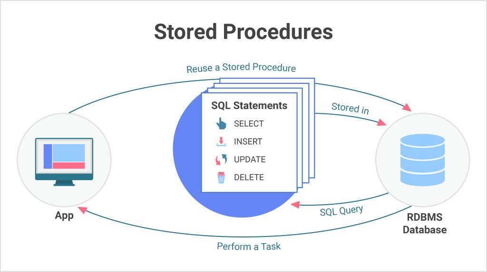
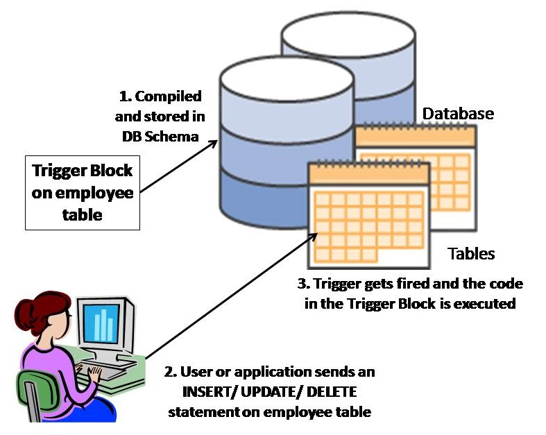

# SP_Trigger_Challenge_Team_FatemaRihamZahra

🧠 __**Explore & Research**__

**1. <ins>What is a Stored Procedure? </ins>** 
 
A stored procedure is a set of SQL statements that perform a specific task, stored in the database for reuse.
They can accept input parameters, return output parameters, and include programming constructs like loops and conditionals.
This allows for complex operations to be encapsulated within the database itself.

	
✅ <ins>Types of Stored Procedures</ins>  
 - System Stored Procedures: Provided by the database system for administrative tasks. 
 - User-Defined Stored Procedures: Custom procedures created by users to perform specific tasks.
 - Extended Stored Procedures: Allow external programs to be executed from within SQL Server.
 - CLR Stored Procedures: Written in .NET languages and integrated into SQL Server for advanced functionality
	
	
 ✅<ins>Benefits of Stored Procedures:</ins>  
 

| Benefit               | Description                             |
| --------------------- | --------------------------------------- |
| **Reusability**     | Write once, use many times              |
| **Maintainability** | Logic centralized in one place          |
|  **Performance**     | Precompiled by the server               |
|  **Security**        | Fine-grained access control             |
|  **Modularity**      | Break down logic into manageable chunks |

	
✅ <ins>How It Works in a Database:</ins>

* Creation: You write the procedure once and store it in the database.

* Storage: The database server compiles and saves it.

* Execution: You call the procedure by name; optionally, pass in parameters.

* Reusability: It can be reused multiple times across applications.

* Security: Users can execute procedures without accessing underlying tables directly.

* Optimization: Stored procedures are parsed and optimized when created, so they often run faster than ad hoc SQL.

✅ <ins>Structure of a Stored Procedure:</ins>

   **1. Name** – Unique name to identify the procedure.

   **2. Parameters** – Accepts input/output parameters (optional).

   **3. Body**  – Contains SQL logic: SELECT, INSERT, UPDATE, DELETE, etc.

✅ <ins> Syntax:</ins>

For MySQL (other databases like SQL Server, Oracle, PostgreSQL have similar concepts with slightly different syntax):

      
       DELIMITER //

     CREATE PROCEDURE procedure_name (
    IN param1 datatype,
    OUT param2 datatype
     )
    BEGIN
    -- SQL statements
     END //

      DELIMITER ;

✅ <ins>Example:</ins>

Stored Procedure to Get Employee Details by Department

    DELIMITER //

     CREATE PROCEDURE GetEmployeesByDepartment (
    IN dept_id INT
     )
    BEGIN
    SELECT id, name, position FROM employees
    WHERE department_id = dept_id;
     END //

    DELIMITER ;

Call it:

      CALL GetEmployeesByDepartment(3);

 ✅ <ins>**Refernces of Stored Procedure**</ins>
--------------------------

1. [What is a Stored Procedure?](https://learn.microsoft.com/en-us/sql/relational-databases/stored-procedures/stored-procedures-database-engine?view=sql-server-ver17&utm.com)
2. [Types of Stored Procedures](https://www.geeksforgeeks.org/what-is-stored-procedures-in-sql/?utm.com)
3. [Types of Stored Procedures](https://learn.microsoft.com/en-us/sql/relational-databases/stored-procedures/stored-procedures-database-engine?view=sql-server-ver17&utm.com)
4. [Benefits of Stored Procedures](https://www.splunk.com/en_us/blog/learn/stored-procedures.html?utm.com)
5. [How It Works in a Databas](https://dev.mysql.com/doc/refman/8.0/en/stored-routines.html)
6. [ Structure of a Stored Procedure](https://learn.microsoft.com/en-us/sql/t-sql/statements/create-procedure-transact-sql?view=sql-server-ver17)
7. [ Syntax  ](https://docs.oracle.com/en/database/oracle/oracle-database/19/lnpls/plsql-subprograms.html)
8. [ CREATE PROCEDURE ](https://www.postgresql.org/docs/current/sql-createprocedure.html)

----------------------------------------------------------

**2. <ins>What is SQL Triggers?</ins>** 

A trigger is a stored procedure in a database that automatically invokes whenever a special
event in the database occurs. By using SQL triggers, developers can automate tasks, ensure data consistency,
and keep accurate records of database activities. For example, a trigger can be invoked when a row is
inserted into a specified table or when specific table columns are updated.

 ✅  <ins>Trigger Properties:</ins>

- It is a special type of stored procedure.
- It executes automatically without requiring manual invocation.
- It is always associated with a specific table in the database.
- It is triggered when a specific event occurs on that table, such as:
 1. INSERT (data entry)
 2. UPDATE (data modification)
 3. DELETE (data deletion)

 

 <ins> Example of use trigger on specific table</ins>:
  

 
 ✅  <ins>Benefits of SQL Triggers</ins>

 | **Benefit**                     | **Description**                                                                      |
| ------------------------------- | ------------------------------------------------------------------------------------ |
| **Automation of Tasks**      | Executes actions automatically in response to table events (INSERT, UPDATE, DELETE). |
| **Data Integrity**           | Enforces data validation rules consistently at the database level.                   |
| **Auditing and Logging**     | Keeps a history of data changes for traceability and compliance.                     |
| **Centralized Logic**        | Business rules are stored in the database, reducing redundancy across apps.          |
| **Improved Security**        | Monitors or restricts sensitive operations (e.g., who can update or delete data).    |
| **Application Consistency**  | Ensures the same behavior across different applications accessing the database.      |
| **Reduced Code Duplication** | Minimizes logic written in applications by handling tasks at the database level.     |
| **Real-time Monitoring**     | Reacts immediately to data changes, useful for alerts or real-time dashboards.       |

**Types of Triggers in DBMS**
1. **DDL Triggers**: 
   - Those type of triggers are activated when changes are made to the structure of the database, such as creating, changing, or deleting tables or other objects.
2. **DML Triggers**: 
   - those type of triggers are triggers are activated by changes to the data in a table.Typically, these changes are made through INSERT, UPDATE, or DELETE statements.     
3. **Logon Triggers**: 
     - These triggers are activated when a user logs into the database. These triggers are mainly used to control who can access the database or to monitor who is logging in.
<ins> Types based on their execution timing<ins>:
   - **BEFORE Trigger**: Executes before the triggering event occurs.Executes before an INSERT, UPDATE, or DELETE operation.
   - **AFTER Trigger**: Executes after the triggering event occurs. Executes after an INSERT, UPDATE, or DELETE operation.
   - **INSTEAD OF Trigger**: Executes in place of the triggering event, allowing custom logic to be applied. Executes in place of an INSERT, UPDATE, or DELETE operation.
✅ <ins>How It Works in a Database:</ins>>
   
**Trigger Uses in real life appliaction**
   - A trigger could **prevent a user from deleting a record** if it is referenced by another table.
   - A trigger could **ensure that a student's grade** is always within the valid range (0 to 100) before it's inserted into the database. 
   - Triggers can help maintain data integrity by **automatically updating related tables or fields when changes occur**. For example, if a student's grade is updated, a trigger could automatically update the student's overall GPA in another table. 
   - Triggers can be used to **log changes made to the database**, such as who made the change and when it occurred. This is useful for auditing purposes and tracking changes over time. For example, a trigger could log every time a student's grade is updated, including the old and new values, the user who made the change, and the timestamp, anthor example is with a financial institution might use a trigger to log every change to a customer's account balance, including the old value, the new value, timestamp, and user ID. 
   - In an e-commerce system, a trigger could be used to automatically update the total sales when a new sale is made.

 - ✅ <ins>**Refernces of Triggers in SQL**</ins>
--------------------------

1. [What is SQL Triggers?](https://www.geeksforgeeks.org/sql-trigger-student-database/)
2. [Types of Triggers in DBMS](https://www.ccbp.in/blog/articles/trigger-in-dbms)
3. [Trigger Uses](https://estuary.dev/blog/database-triggers/)

	
	

