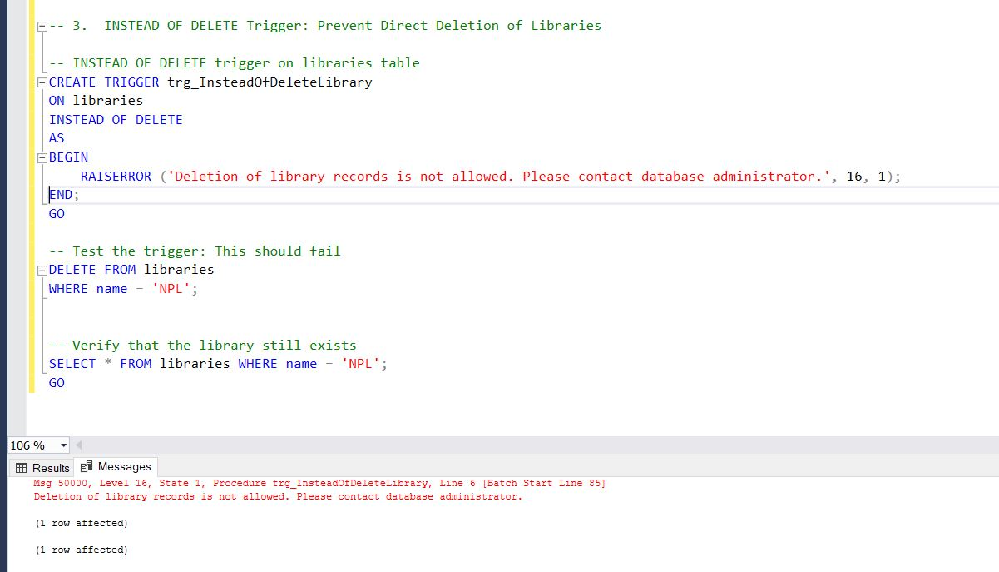

 # 🧠 Apply Trigger in Practice  
 ### AFTER INSERT Trigger: Log New Book Additions
```
Create an audit table for books
CREATE TABLE Book_Audit (
    audit_id INT PRIMARY KEY IDENTITY,
    book_id INT NOT NULL,
    title VARCHAR(20) NOT NULL,
    action_type VARCHAR(50) NOT NULL,
    action_date DATETIME DEFAULT GETDATE()
);
-- AFTER INSERT trigger on books table
CREATE TRIGGER trg_AfterInsertBook
ON books
AFTER INSERT
AS
BEGIN
    INSERT INTO Book_Audit (book_id, title, action_type)
    SELECT book_id, title, 'New Book Added'
    FROM INSERTED;
END;
-- Test the trigger
INSERT INTO books (ISBM, title, genre, price, avail_status, shelf_location, library_id)
VALUES (9781011, 'Gardening Basics', 'Non-fiction', 8.500, 1, 'B4', 2);
-- Verify the audit table
SELECT * FROM Book_Audit;
```


### BEFORE UPDATE Trigger: book avilable
```
CREATE TRIGGER trg_UpdateBookStatusAfterLoan
ON loan
AFTER INSERT
AS
BEGIN
   -- Update the book's availability status to 0 (borrowed)
    UPDATE books
    SET avail_status = 0
    FROM books
    INNER JOIN inserted i ON books.book_id = i.book_id
END;
INSERT INTO loan (loan_id, book_id, member_id, loan_date, due_date, return_date, status)
VALUES (11, 6, 4, '2025-05-28', '2025-06-11', '2025-06-10', 'issued');
select * from books
INSERT INTO loan (loan_id, book_id, member_id, loan_date, due_date, return_date, status)
VALUES (12, 1, 4, '2025-05-28', '2025-06-11', '2025-06-10', 'issued');
select * from books
select * from loan
select * from member
```


### 3.INSTEAD OF DELETE Trigger: Prevent Direct Deletion of Libraries

```
INSTEAD OF DELETE trigger on libraries table
CREATE TRIGGER trg_InsteadOfDeleteLibrary
ON libraries
INSTEAD OF DELETE
AS
BEGIN
    RAISERROR ('Deletion of library records is not allowed. Please contact database administrator.', 16, 1);
END;
GO

-- Test the trigger: This should fail
DELETE FROM libraries
WHERE name = 'NPL';


-- Verify that the library still exists
SELECT * FROM libraries WHERE name = 'NPL';
```


### What happens when you DROP a table with triggers? 
 
 When you drop a table that has triggers associated with it, the triggers are automatically dropped as well. This means that any logic defined in those triggers will no longer be executed, and the trigger definitions will be removed from the database.

 ``` -- Example: Dropping the books table
 DROP TABLE books;
 -- This will also drop any triggers associated with the books table
 ```

 ### What if data doesn’t meet the condition inside trigger? 
 When data does not meet the conditions specified in a trigger, the trigger's logic will not execute, and the operation (INSERT, UPDATE, DELETE) will proceed as normal. However, if the trigger contains logic that raises an error or prevents the operation based on certain conditions, then the operation will be halted, and an error message will be returned.
 ```sql
 -- Example: Trigger that prevents insertion of books with a price less than 0
 CREATE TRIGGER trg_PreventNegativePrice
 ON books
 AFTER INSERT
 AS
 BEGIN
    IF EXISTS (SELECT * FROM inserted WHERE price < 0)
    BEGIN
        RAISERROR('Price cannot be negative.', 16, 1);
        ROLLBACK TRANSACTION; -- Rollback the transaction if condition is met
    END
    END;
    -- Test the trigger
    INSERT INTO books (ISBM, title, genre, price, avail_status, shelf_location, library_id)
    VALUES (9781012, 'Negative Price Book', 'Fiction', -5.00, 1, 'B5', 1);
    -- This will raise an error and rollback the transaction
 ```

 